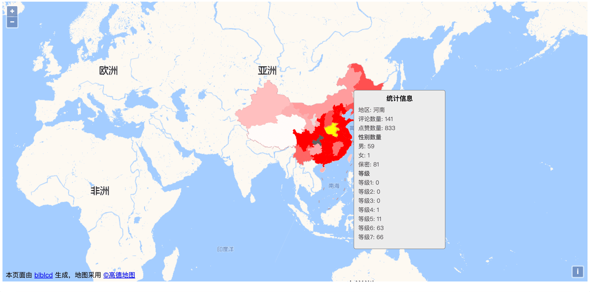
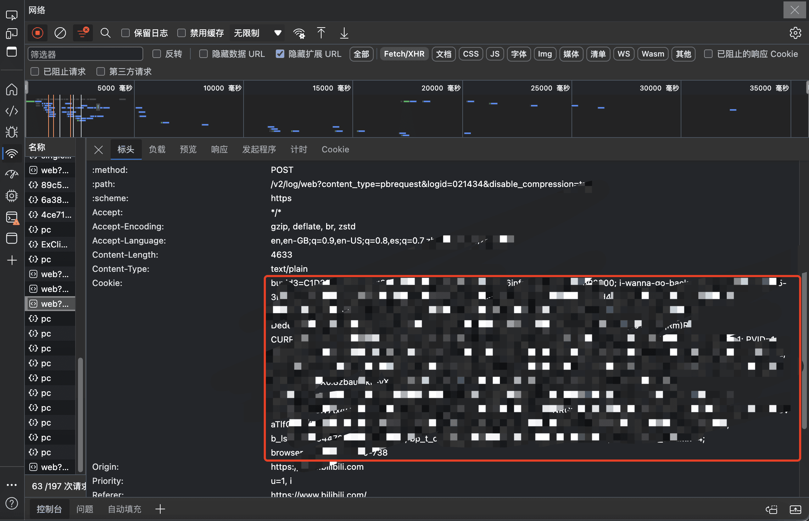

      

---

<p align="center">
</p>

blblcd（Bilibili Comment Dowloader），一款基于 [bilibili-API-collect](https://github.com/SocialSisterYi/bilibili-API-collect) 的B站视频评论下载工具。

🗂️ 仓库： [Codeberg](https://codeberg.org/wsh233/blblcd) | [GitHub](https://github.com/WShihan/blblcd) 


🎉 特点

* 使用方便，仅包含一个可执行文件，无需安装其他依赖。
* 下载单/多个视频评论，可按热评/时间顺序。
* 下载指定UP主视频的评论，可按投稿时间/收藏/播放顺序。
* 下载子评论，可下载隐藏评论和“楼中楼”评论。
* 下载评论中的图片，可将图片下载到本地同时将链接写入csv。
* 地图统计，支持评论统计输出为地图展示。
* 跨平台，支持Mac，Linux， Windows。


🔔 请留意

* 这是一个命令行程序，没有图形化界面。
* 若爬取结果数量不对只有十几条评论和网页上看到的数量不一致，那么很大概率是cookie失效导致。
* 爬取结果的csv文件编码为utf-8，使用诸如Microsoft Office之类的办公软件打开会显示乱码，建议用记事本或者代码编辑器打开。
* 目前以维护已有功能为主，该工具基本符合本人需求，暂不接受新增功能开发请求。当然如果你发现已有功能出现bug，欢迎提交issue，我将尽力去解决。


⚠️ 请注意

>  最新代码托管在[Codeberg](https://codeberg.org/wsh233/blblcd)，本仓库仅作为备份，同步更新可能存在延迟。由于GitHub访问原因，0.1.8之后的版本，其编译后的二进制产物将只发布在[Codeberg Releases](https://codeberg.org/wsh233/blblcd/releases) 。


爬取评论信息如下：

```text
	Uname         名称
	Sex           性别
	Content       评论内容
	Rpid          评论id
	Oid           评论区id
	Bvid          视频bv
	Mid           发送者id
	Parent        父级评论
	Fansgrade     是否粉丝标签
	Ctime         评论时间戳
	Like          喜欢数
	Following     是否关注
	Current_level 当前等级
	Location      位置
```

效果
===




使用
====

## 需要准备

* cookie ：必须
* mid ：up主编号，当查找up视频时必须
* bvid：稿件视频编号，当单独下载单个/多个视频评论时必须

然后到[release](https://codeberg.org/wsh233/blblcd/releases) 页面下载操作系统对应的二进制可执行文件。


#### 获取Cookie

登录[哔哩哔哩 ](https://www.bilibili.com/)，按住`F12`进入开发者工具页面，选择`网络`，点击其中任意一条请求，（最好是XHR或Fetch类型的请求）查看请求头，将Cookie值复制后，在本地保存为text文件（最好是与blblcd放置于同一个目录下，命名为cookie.text，程序会自动读取）。




#### 获取up主mid

进入up主页，浏览器地址栏上将会显示mid，复制它，例如下面链接里的mid为`112233445`。


#### 获取视频bvid

进入视频页面，查看浏览器地址栏，URL第二段就是bvid，例如`BV1Cm421T7Zg`


## 使用命令

在终端输入`-h`查看所有命令，参数及其简写。

```bash
./blblcd -h
```

### 示例

#### 单个/多个视频

基础

```bash
blblcd video BV1VJ4m1jk34K
```

多个视频

```bash
blblcd video BV1VJ4m1jk34K  BV1sdfVJ4m1jksdf
```

开启下载评论中的图片

```bash
blblcd video BV1VJ4m1jk34K --img-download
```

指定评论按`回复`顺序

```bash
blblcd video BV1VJ4m1jk34K --corder 2
```

指定`cookie`文件位置

```bash
blblcd video BV1VJ4m1jk34K --cookie /path/to/cookiefile.text  --corder 2
```

输出位置

```bash
blblcd video BV1VJ4m1jk34K --corder 2 --output path/to/output
```


#### up视频列表

基础（默认获取前三页，一页30条视频）

```bash
blblcd up 123344555
```

指定`cookie`

```bash
blblcd up 123344555 --cookie /path/to/cookiefile.text
```

视频列表顺序，按`最多收藏`

```bash
blblcd up 123344555 --skip 3 --pages 5 --vorder stow
```

固定页数

```bash
blblcd up 123344555 --pages 5
```

忽略页数，跳过前三页后获取5页，即4-8页

```bash
blblcd up 123344555 --skip 3 --pages 5
```

输出位置

```bash
blblcd up 123344555  --output output/path
```

并发数量

```bash
blblcd up 123344555  --workers 10
```


#### 输出地图统计

```bash
blblcd video BV1VJ4m1jk34K --mapping 
```


[](https://star-history.com/#WShihan/blblcd&Date)


声明
====

* 源代码仅供交流学习使用，切勿用于违法犯罪。
* 使用该工具请遵守`Bilibili`相关规定。
* blblcd不会保存或泄露`Cookie`，请放心食用。
