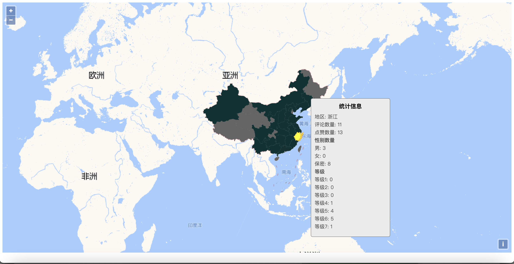
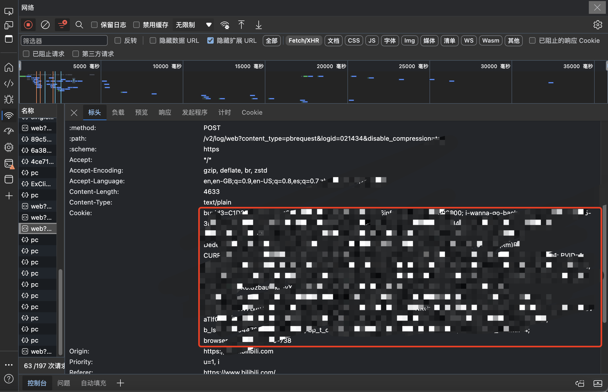

blblcd
====

blblcd（Bilibili-comment-dowloader），一款基于[bilibili-API-collect](https://github.com/SocialSisterYi/bilibili-API-collect)的Bilibili视频评论下载工具。


特点：

* 使用方便，工具主体仅包含一个可执行文件，无需额外安装其他依赖。
* 下载单个/多个视频评论，可按热评/时间顺序。
* 下载指定UP主视频的评论，可按投稿时间/收藏/播放顺序下载某up主投稿的多个视频评论。
* 下载子评论，可下载隐藏评论和“楼中楼”评论。
* 下载评论中的图片，可将图片下载到本地同时将链接写入csv。
* 支持评论统计输出为地图展示。
* 支持MacOS，Linux， Windows


🔔 请留意

* 这是一个命令行程序，没有图形化界面。
* 子评论自动爬取，同时控制台会输出相应的页码，非陷入死循环。
* 如果爬取结果数量不对只有十几条评论和网页上看到的数量不一致，那么很大概率是cookie失效了。
* 爬取保存的csv文件编码格式为utf-8，使用诸如Microsoft Office之类的办公软件打开会显示乱码，建议用记事本或者代码编辑器打开(如果想要使用上述软件打开，需要将编码转为GBK或GB2312)。
* 为不触发反爬，程序人为降低了请求频率，所以爬取速度比较慢。
* 目前以维护已有功能为主，该工具基本符合本人需求，暂不接受新增功能开发请求。当然如果你发现已有功能出现bug，欢迎提交issue，我将尽力去解决。


爬取评论信息如下：

```
	Uname         名称
	Sex           性别
	Content       评论内容
	Rpid          评论id
	Oid           评论区id
	Bvid          视频bv
	Mid           发送者id
	Parent        父级评论
	Fansgrade     是否粉丝标签
	Ctime         评论时间戳
	Like          喜欢数
	Following     是否关注
	Current_level 当前等级
	Location      位置
```

下载后单个视频的所有评论保存为一份csv，也可统计输出为geojson，地图模板。

效果
===




使用
====

## 需要准备

* cookie ：必须
* mid ：up主代码，当查找up视频时必须
* bvid：稿件视频id，单独下载单个/多个视频评论时必须


#### 获取cookie

登录[哔哩哔哩 ](https://www.bilibili.com/)，按住`F12`进入开发者工具页面，选择`网络`，点击其中任意一条请求，（最好是XHR或Fetch类型的请求）查看请求头，将cookie值复制后，在本地保存为text文件（最好是与blblcd放置于同一个目录下，命名为cookie.text）。




#### 获取up主mid

进入up主页，浏览器地址栏上将会显示mid，复制它，例如下面链接里的mid为`112233445`。


#### 获取视频bvid

进入视频页面，查看浏览器地址栏，URL第二段就是bvid，例如`BV1Cm421T7Zg`


## 使用命令

在终端输入-help查看所有指令

```bash
./blblcd -h
```


### 示例

#### 单个/多个视频

基础

```bash
blblcd video BV1VJ4m1jk34K
```

多个视频

```bash
blblcd video BV1VJ4m1jk34K  BV1sdfVJ4m1jksdf
```

指定评论按`回复`顺序

```bash
blblcd video BV1VJ4m1jk34K -corder 2
```

指定`cookie`文件

```bash
blblcd video BV1VJ4m1jk34K -cookie /path/to/cookiefile.text  -corder 2
```

输出位置

```bash
blblcd video BV1VJ4m1jk34K -corder 2 -output path/to/output
```


#### up视频列表

基础（默认获取前三页，一页30条视频）

```bash
blblcd up 123344555
```

指定`cookie`

```bash
blblcd up 123344555 -cookie /path/to/cookiefile.text
```

视频列表顺序，按`最多收藏`

```bash
blblcd up 123344555 -skip 3 -pages 5 -vorder stow
```

固定页数

```bash
blblcd up 123344555 -pages 5
```

忽略页数，跳过前三页后获取5页，即4-8页

```bash
blblcd up 123344555 -skip 3 -pages 5
```


输出位置

```bash
blblcd up 123344555  -output output/path
```


并发数量

```bash
blblcd up 123344555  -workers 10
```


#### 输出地图模板

需要在程序所在位置添加`geo-template.geojson`，该资源已包含在release里。

```bash
blblcd video BV1VJ4m1jk34K --mapping 
```


[](https://star-history.com/#WShihan/blblcd&Date)


声明
====

* 源代码仅供交流学习使用，切勿用于违法犯罪。
* 使用该工具请遵守Bilibili相关规定
* blblcd不会保存或泄露cookie，请放心食用。
